# ScubaPilot — Guide complet

**Version 1.3 — Octobre 2026**

Ce guide accompagne l'utilisateur de l'installation jusqu'à l'utilisation quotidienne : suivi des cours, des étudiants et de leurs documents, communications, certification, facturation, sauvegarde et mises à jour.

## Table des matières

1. [Présentation](#1-présentation)
2. [Installation](#2-installation)
3. [Lancer et arrêter l'application](#3-lancer-et-arrêter-lapplication)
4. [Configuration initiale (premiers pas)](#4-configuration-initiale-premiers-pas)
5. [Utilisation quotidienne](#5-utilisation-quotidienne)
6. [Documents, fichiers et photos](#6-documents-fichiers-et-photos)
7. [Communications (emails)](#7-communications-emails)
8. [Certification et transfert de dossier](#8-certification-et-transfert-de-dossier)
9. [Facturation](#9-facturation)
10. [Rapports et sommaire](#10-rapports-et-sommaire)
11. [Paramètres en détail](#11-paramètres-en-détail)
12. [Organisation des données sur le disque](#12-organisation-des-données-sur-le-disque)
13. [Sauvegarde](#13-sauvegarde)
14. [Mise à jour de l'application](#14-mise-à-jour-de-lapplication)
15. [Dépannage](#15-dépannage)
16. [Notes techniques](#16-notes-techniques)

---

## 1. Présentation

ScubaPilot est une application **locale** : elle tourne sur votre ordinateur et rien n'est envoyé sur internet. Elle sert à gérer l'activité d'un instructeur de plongée indépendant :

- les **cours** (séances, sites, centre mandataire, instructeurs) ;
- les **étudiants** et leurs coordonnées, avec une fiche globale qui suit l'étudiant d'un cours à l'autre ;
- les **checklists de documents** (avant et après le cours) et le pourcentage de complétion ;
- les **communications** (convocations, rappels) ;
- la **certification** (instructeur certificateur) ou le **transfert de dossier** ;
- la **facturation** au centre (aperçu en direct, PDF, courriel) ;
- les **rapports imprimables** et la **sauvegarde**.

L'application s'utilise dans votre navigateur, à l'adresse `http://localhost:4531`. Les données sont de simples fichiers dans des dossiers de votre choix : vous gardez toujours le contrôle.

Hors périmètre : gestion du matériel, des bateaux, de la caisse ou de la location.

## 2. Installation

L'installation se fait une seule fois. L'application est écrite pour **Windows** ; le serveur fonctionne aussi sous macOS et Linux, mais le bouton « Ouvrir dans l'Explorateur » et la sauvegarde en .zip utilisent des outils Windows (voir [Notes techniques](#16-notes-techniques)).

### 2.1 Installer Node.js

1. Allez sur <https://nodejs.org/> et téléchargez la version **LTS** (18 ou plus récente).
2. Lancez l'installateur et gardez les options par défaut.
3. Vérifiez : ouvrez une invite de commande (touche Windows, tapez `cmd`) et tapez `node -v`. Un numéro de version doit s'afficher (ex. `v22.x.x`).

### 2.2 Récupérer l'application

**Option A — téléchargement du zip** (le plus simple) : décompressez `ScubaPilot-v1.3.zip` où vous voulez, par exemple `C:\Apps\ScubaPilot`. Choisissez un emplacement qui ne change pas (évitez le dossier Téléchargements).

**Option B — depuis GitHub** (si vous avez Git) :

```
git clone https://github.com/almtlsandbox/scubapilot.git C:\Apps\ScubaPilot
```

Le dépôt est privé : Git vous demandera de vous connecter à votre compte GitHub. Pour mettre à jour plus tard : `git pull`.

### 2.3 Installer les dépendances

1. Ouvrez une invite de commande **dans le dossier de l'application** (dans l'Explorateur, tapez `cmd` dans la barre d'adresse du dossier, puis Entrée).
2. Tapez :
   ```
   npm install
   ```
3. Attendez la fin (quelques secondes). Un dossier `node_modules` apparaît : c'est normal.

## 3. Lancer et arrêter l'application

### Option A — manuellement

Double-cliquez sur **`Lancer (avec fenetre).bat`**. Une fenêtre noire s'ouvre (**laissez-la ouverte** pendant que vous travaillez) et votre navigateur s'ouvre sur l'application. Pour quitter, fermez la fenêtre noire.

### Option B — démarrage automatique et silencieux

1. `Win + R`, tapez `shell:startup`, Entrée : le dossier « Démarrage » de Windows s'ouvre.
2. Dans le dossier de l'application, faites un clic droit sur **`Demarrage-automatique.vbs`** → **Créer un raccourci**, puis déplacez ce raccourci dans le dossier « Démarrage ».
3. À chaque ouverture de session, l'application démarre sans fenêtre. Ouvrez simplement `http://localhost:4531` dans votre navigateur (ajoutez-le aux favoris ou créez un raccourci sur le bureau).
4. Pour l'arrêter (par exemple avant une mise à jour) : double-cliquez sur **`Arreter.bat`**.
5. En cas de souci, consultez le fichier `app.log` créé dans le dossier de l'application.

Le numéro de version est affiché en bas de la barre latérale (« ScubaPilot v1.3 »).

## 4. Configuration initiale (premiers pas)

Faites ces étapes dans l'ordre la première fois (menu **Paramètres**).

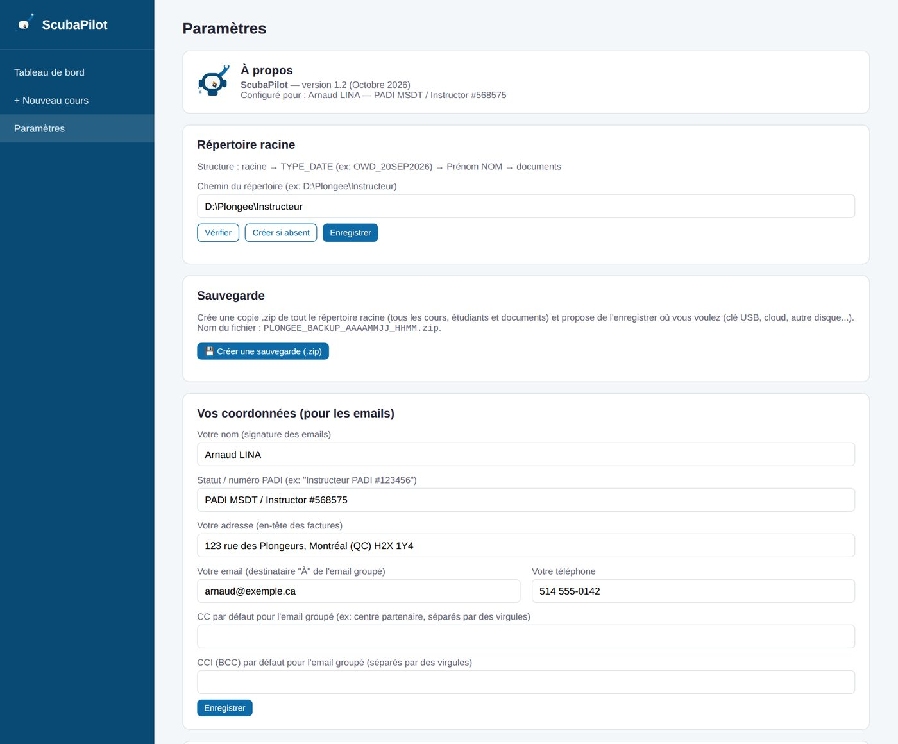
*Paramètres : répertoire racine, sauvegarde et vos coordonnées*

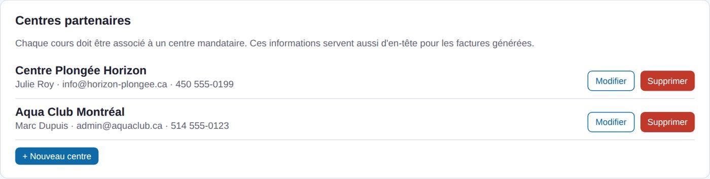
*Paramètres : centres partenaires*


1. **Répertoire racine** — Indiquez le dossier où seront rangés tous vos cours et documents (ex. `D:\Plongee\Instructeur`). Cliquez sur « Créer si absent » s'il n'existe pas encore. Choisissez un dossier que vous sauvegardez régulièrement.
2. **Vos coordonnées** — Nom, numéro PADI (ex. `PADI MSDT / Instructor #568575`), **adresse**, téléphone, courriel. Ces informations servent aux emails et à l'en-tête des factures. C'est aussi ici que vous réglez vos CC/BCC par défaut pour l'email groupé.
3. **Centres partenaires** — Ajoutez au moins un centre (nom, contact, adresse, courriel, téléphone, n° de taxe ou référence). **Un centre est obligatoire pour créer un cours.**
4. **Coéquipiers** — Ajoutez les personnes avec qui vous travaillez (nom, rôle, courriel). Un collègue instructeur est un coéquipier de rôle « Instructeur » : cette liste sert aussi à choisir l'instructeur certificateur.
5. **Types de cours, sites de plongée, champs du profil étudiant, modèles d'email** — Vérifiez les valeurs par défaut et adaptez-les (voir [section 11](#11-paramètres-en-détail)).
6. **Facturation** — Réglez la devise, les taxes, le pied de page, ajoutez l'image de votre **étampe** et créez vos **grilles de tarifs** (voir [section 9](#9-facturation)).

Vous êtes prêt : créez votre premier cours.

## 5. Utilisation quotidienne

### 5.1 Tableau de bord

Page d'accueil. Elle présente deux listes :

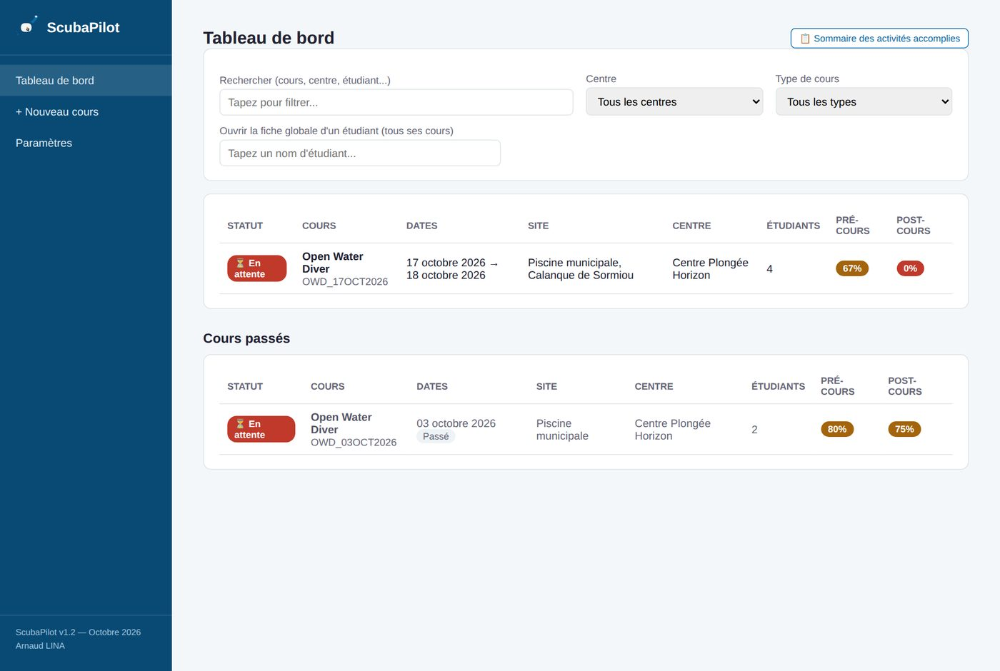
*Le tableau de bord*


- **À venir** : le prochain cours en haut, du plus proche au plus lointain ;
- **Cours passés** : du plus récent au plus ancien, grisés. Un cours est « passé » quand sa dernière séance est antérieure à aujourd'hui.

Une colonne **Statut** résume chaque cours :

| Statut | Signification |
|---|---|
| ✅ Clos | Le cours a été marqué complété manuellement |
| ⏳ En attente | Des documents pré- ou post-cours ne sont pas à 100 % |
| 🔷 Prêt à clôturer | Tous les documents sont à 100 %, mais le cours n'est pas encore marqué complété |

Au-dessus des listes : une **recherche** instantanée (nom de cours, centre ou étudiant), des **filtres** par centre et par type, et le champ **« Ouvrir la fiche globale d'un étudiant »** qui propose un étudiant au fil de la frappe.

Le bouton **« 📋 Sommaire des activités accomplies »** ouvre un rapport imprimable de tous vos cours (voir [section 10](#10-rapports-et-sommaire)).

### 5.2 Créer un cours

Menu **+ Nouveau cours** :

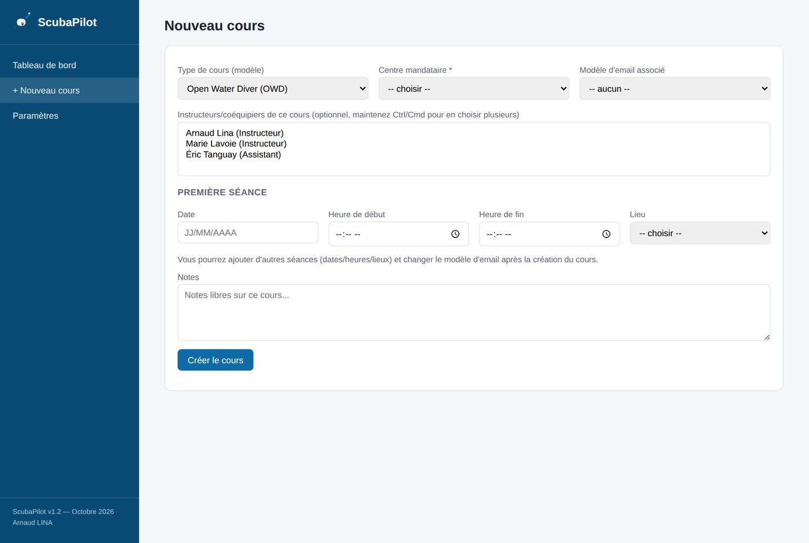
*Le formulaire de nouveau cours*


1. Choisissez le **type de cours** (OWD, Rescue, etc.).
2. Choisissez le **centre mandataire** (obligatoire).
3. Entrez la **date** de la première séance, l'heure et le site.
   - **Date** : tapez les 8 chiffres à la suite (`17102026` devient `17/10/2026`, les `/` s'insèrent seuls) **ou** cliquez sur le bouton 📅 à droite du champ pour choisir dans un petit calendrier.
   - **Heure** : format 24 h. Tapez par exemple `930` (devient `09:30`) ou `9` (devient `09:00`), ou cliquez dans le champ pour choisir parmi les suggestions toutes les 15 minutes (de 06:00 à 22:00). Une heure invalide est effacée.
4. Sélectionnez les **instructeurs** rattachés au cours (parmi vos coéquipiers).
5. Choisissez au besoin un **modèle d'email** par défaut et ajoutez des notes.

Le cours est créé dans votre répertoire racine sous le nom `TYPE_DATE` (ex. `OWD_03OCT2026`), avec un sous-dossier `Photo`.

### 5.3 La fiche d'un cours

En haut : dates, sites, centre, instructeurs, dossier, pourcentages globaux de documents pré/post-cours et les actions (modifier, exporter le rapport, **🧾 Facture**, supprimer, marquer complété). Dessous, trois onglets (l'onglet actif est conservé lors des rafraîchissements) :

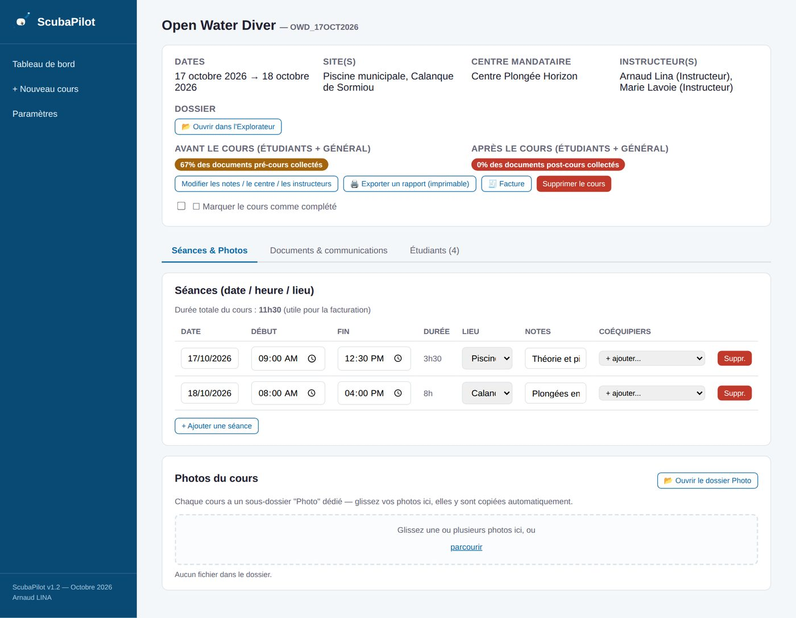
*Fiche de cours : onglet Séances & Photos*

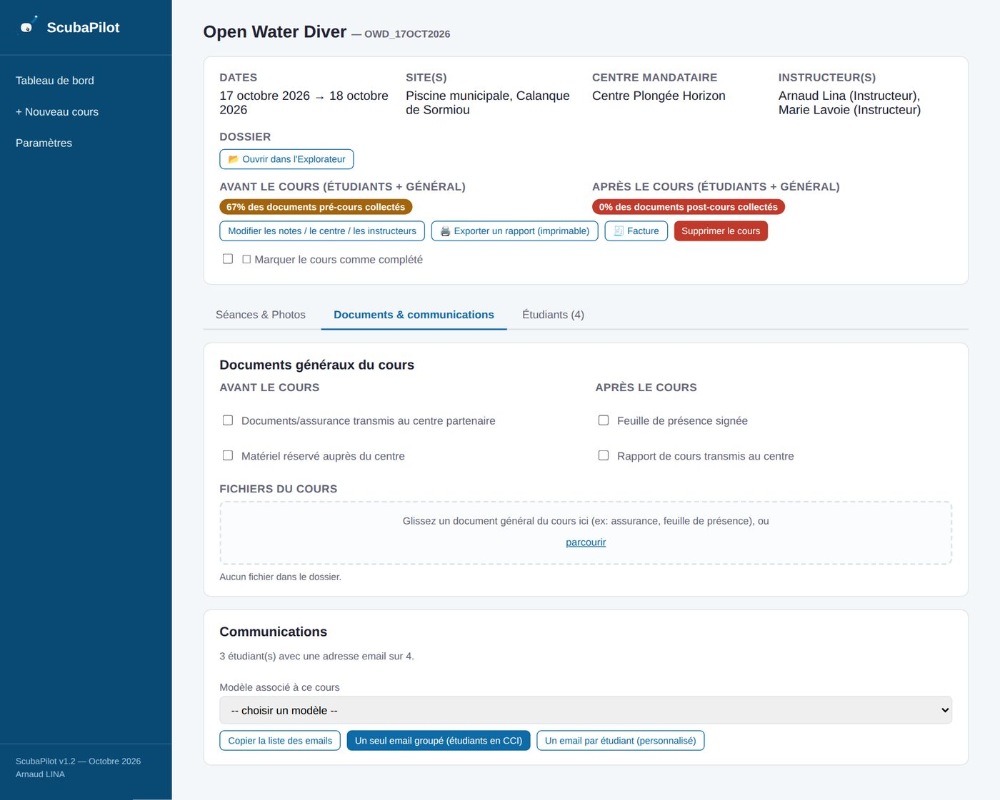
*Fiche de cours : onglet Documents & communications*

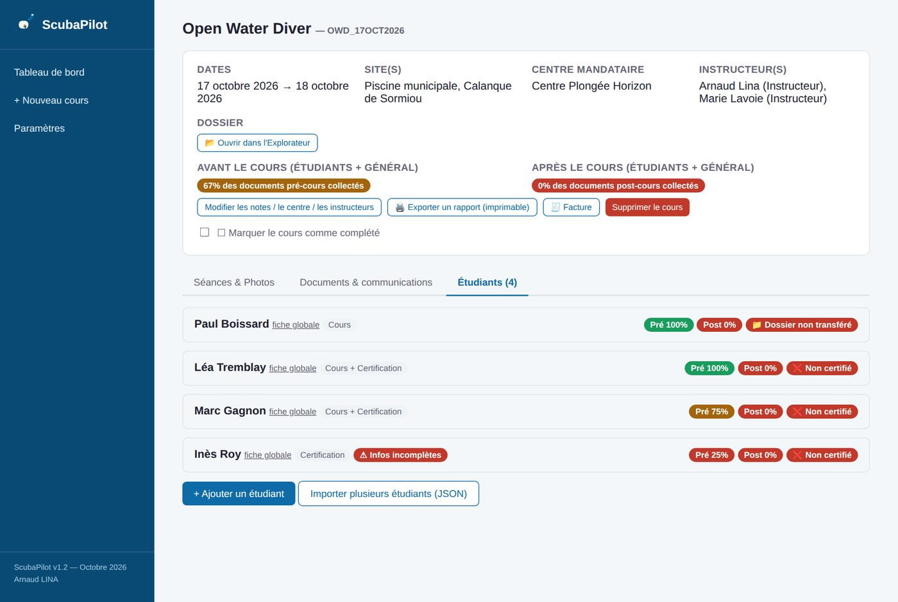
*Fiche de cours : onglet Étudiants*


**Séances & Photos**
- Un cours peut avoir **plusieurs séances** (théorie, piscine, fosse, mer…), chacune avec date, heure de début, heure de fin, site et notes. La **durée** est calculée automatiquement et la durée totale du cours s'affiche en haut.
- Tous les champs sont modifiables directement dans le tableau : la valeur s'enregistre toute seule (un changement de date recharge la page pour retrier).
- Sur chaque séance, ajoutez des **coéquipiers** via le menu « + ajouter… » ; leur courriel est inclus en copie cachée dans l'email groupé.
- La carte **Photos du cours** reçoit vos photos par glisser-déposer.

**Documents & communications**
- **Documents généraux du cours** (assurance transmise au centre, feuille de présence…) : checklist définie par le type de cours.
- **Communications** : génération des emails (voir [section 7](#7-communications-emails)).

**Étudiants**
- Liste des étudiants avec leur checklist, leurs coordonnées et leur statut (voir ci-dessous).

### 5.4 Ajouter des étudiants

Dans l'onglet **Étudiants** :

- **Ajouter un étudiant** : remplissez le formulaire (prénom et nom obligatoires). Un dossier `Prénom NOM` est créé dans le dossier du cours. Si l'étudiant a déjà suivi un cours, **recherchez-le par nom** : ses coordonnées sont copiées depuis son cours précédent.
- **Importer plusieurs étudiants (JSON)** : voir [5.9](#59-importer-un-roster-pdf).

### 5.5 La fiche d'un étudiant (dans un cours)

Dépliez l'étudiant pour voir :

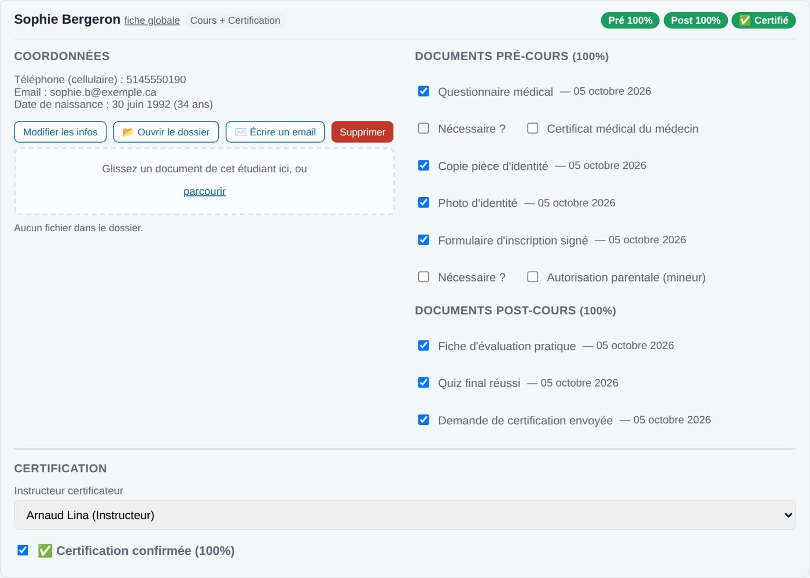
*Étudiant avec certification : instructeur certificateur et certification confirmée*

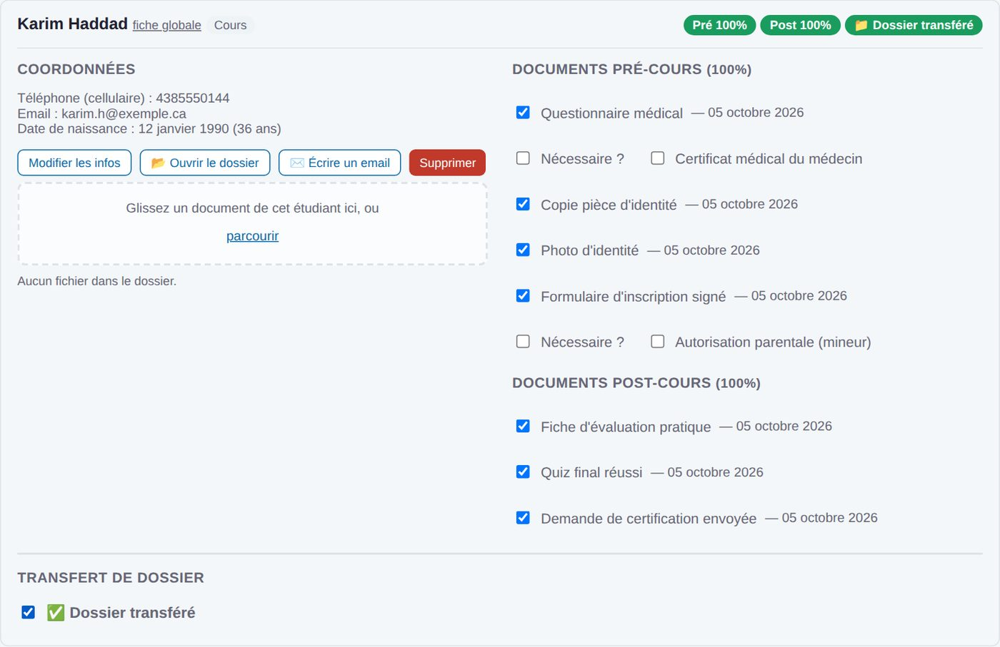
*Étudiant « cours seulement » : transfert de dossier*


- ses **coordonnées**, son **âge** calculé à partir de la date de naissance, et son **statut** : *Cours seulement*, *Certification* ou *Cours + Certification* (les libellés sont modifiables dans Paramètres) ;
- un badge **⚠ Infos incomplètes** s'il manque un téléphone, un courriel ou une date de naissance (survolez le badge pour voir quoi) ;
- la **checklist pré-cours et post-cours** : cochez les cases au fur et à mesure (vous pouvez enchaîner les clics sans rechargement). Une date est enregistrée à chaque réception ;
- la zone de **dépôt de fichiers**, le bouton **📂 Ouvrir dans l'Explorateur** et le bouton **✉️ Écrire un email** ;
- la section **Certification** ou **Transfert de dossier** (voir [section 8](#8-certification-et-transfert-de-dossier)) ;
- le lien **fiche globale**.

### 5.6 Statuts de documents et pourcentages

Chaque document d'une checklist est :

- **obligatoire** (`required`) : toujours compté dans le pourcentage ;
- **facultatif** (`optional`) : jamais compté (informatif) ;
- **conditionnel** (`conditional`) : un interrupteur **« Nécessaire ? »** apparaît pour chaque étudiant. Le document ne compte que si l'interrupteur est activé (par exemple un certificat médical selon le questionnaire, ou l'autorisation parentale selon l'âge).

Les pourcentages « Pré » et « Post » sont calculés à partir de la liste des documents du type de cours : un document ajouté plus tard au type apparaît donc correctement comme manquant chez les étudiants existants.

### 5.7 La fiche étudiant globale

Un même étudiant peut suivre plusieurs cours. Sa **fiche globale** (lien à côté de son nom, ou via la recherche du tableau de bord) réunit :

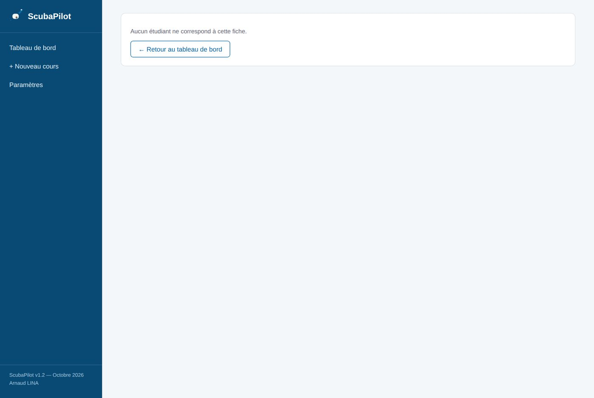
*La fiche étudiant globale*


- l'**historique** de tous ses cours (date, type, centre, % pré/post, certification ou transfert, instructeur certificateur), cliquable ;
- ses **coordonnées** les plus récentes. Le bouton **« Mettre à jour partout »** reporte une correction (ex. un nouveau numéro de téléphone) dans le dossier de l'étudiant de chacun de ses cours.

### 5.8 Clore et supprimer

- **Marquer un cours comme complété** : case en bas à droite de la carte du cours. Un badge ✅ Clos apparaît à côté du titre.
- **Supprimer un cours ou un étudiant** efface réellement les dossiers et documents sur le disque. Il faut donc **retaper le nom exact** dans la fenêtre de confirmation avant que le bouton ne s'active. Pensez à votre [sauvegarde](#13-sauvegarde) avant.

### 5.9 Importer un roster (PDF)

L'application n'ouvre pas les PDF elle-même. Pour importer une liste d'étudiants :

1. Donnez le PDF à Claude (ou un autre assistant) en demandant un tableau JSON d'étudiants avec `firstName`, `lastName`, `email`, `phoneCell`, etc.
2. Sur la fiche du cours, cliquez sur **« Importer plusieurs étudiants (JSON) »**, collez le résultat et cliquez sur **Importer**.
3. Les étudiants et leurs dossiers sont créés ; les doublons (même prénom et nom dans ce cours) sont ignorés et listés.

## 6. Documents, fichiers et photos

Trois zones acceptent le **glisser-déposer** (ou le bouton « parcourir », avec sélection multiple) :

| Zone | Où le fichier est copié |
|---|---|
| Documents généraux du cours | Dossier du cours |
| Fiche d'un étudiant | Dossier de l'étudiant |
| Photos du cours | Sous-dossier `Photo` du cours (créé automatiquement, même pour les anciens cours) |

Si un fichier du même nom existe déjà, une copie `nom (2).ext` est créée : jamais d'écrasement. La liste des fichiers réellement présents se met à jour immédiatement.

Vous pouvez aussi déposer vos scans directement dans les dossiers via l'Explorateur Windows (bouton **📂 Ouvrir dans l'Explorateur** sur chaque cours et chaque étudiant).

## 7. Communications (emails)

L'application n'envoie pas de courriel elle-même : elle prépare le message et ouvre votre client de messagerie (ou vous permet de copier le texte).

### 7.1 Deux façons d'écrire

- **Un email groupé** : un seul message, adressé à vous-même (« À »), avec un CC configurable (ex. le centre) et en **copie cachée** : tous les étudiants du cours, les coéquipiers des séances et votre BCC par défaut. Comme le message n'est pas personnalisé, `{prenom}`, `{nom}` et `{liste_docs_manquants}` restent vides : préférez `{liste_etudiants}`.
- **Un email par étudiant** : un message distinct avec ses documents manquants. Utile pour les relances. Le bouton **✉️ Écrire un email** de la fiche d'un étudiant ouvre aussi un message déjà adressé (et rédigé si le cours a un modèle associé).

Des boutons permettent de copier une adresse, toutes les adresses ou tous les messages d'un coup.

### 7.2 Modèles d'email

Dans **Paramètres → Modèles d'email**, vous gérez une bibliothèque de modèles nommés, aussi nombreux que vous voulez. Chaque cours a un **modèle par défaut** (choisi à la création, modifiable dans la carte « Communications » : enregistré automatiquement).

Variables disponibles dans le sujet et le corps :

| Variable | Contenu |
|---|---|
| `{type_cours}` | Nom du type de cours |
| `{prenom}`, `{nom}` | Étudiant (email individuel) |
| `{liste_docs_pre}` | Documents pré-cours à apporter |
| `{liste_docs_manquants}` | Documents manquants de l'étudiant |
| `{liste_etudiants}` | Noms de tous les étudiants (email groupé seulement) |
| `{liste_dates_lieux}` | Séances : date, heure, lieu |
| `{liste_dates_lieux_note_coequipier}` | Version narrative : « Rendez-vous le [date] à [heure], [lieu], [notes], et nous serons accompagnés de [coéquipiers] » |
| `{date_debut}`, `{date_fin}`, `{lieu}` | Format simple |
| `{instructeur}`, `{instructeur_padi}`, `{instructeur_tel}` | Vos coordonnées (signature) |

## 8. Certification et transfert de dossier

Le dernier contrôle d'un étudiant dépend de son **statut**.

**Étudiants avec certification** (statut *Certification* ou *Cours + Certification*) :

1. Dans la fiche dépliée, section **Certification**, choisissez l'**instructeur certificateur** : il est pris parmi les coéquipiers rattachés au cours. Si aucun n'est rattaché, un lien permet de le faire depuis la fiche.
2. La case **« 🎓 Certification confirmée (100 %) »** reste **désactivée tant qu'aucun instructeur n'est choisi**.
3. Une fois cochée, un badge **🎓 Certifié** apparaît dans l'en-tête de l'étudiant, sur la fiche globale et sur le rapport imprimable.

**Étudiants en cours seulement** : la certification ne s'applique pas. Une case finale **« Transfert de dossier »** la remplace, avec le badge **📁 Dossier transféré** ou **📁 Dossier non transféré** (en-tête, fiche globale, rapport).

> Si vous renommez les statuts dans Paramètres, l'application reconnaît quand même les étudiants « cours seulement ».

## 9. Facturation

### 9.1 Configuration (une fois)

Dans **Paramètres → Facturation** :

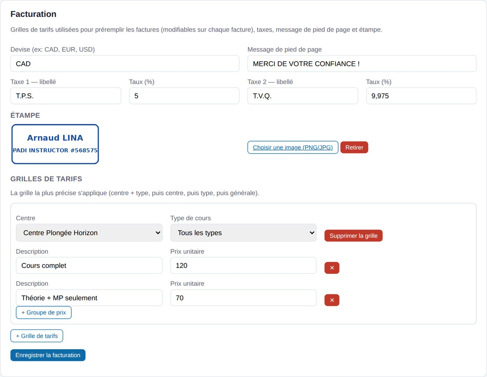
*Paramètres : facturation (taxes, étampe, grilles de tarifs)*


- **Devise** (CAD par défaut) ;
- **Taxes** : deux taxes avec libellé et taux (T.P.S. 5 % et T.V.Q. 9,975 % au départ). Elles ne s'appliquent que si vous les cochez sur une facture ;
- **Message de pied de page** (« MERCI DE VOTRE CONFIANCE ! ») ;
- **Étampe** : choisissez une image PNG ou JPG (idéalement fond transparent ou blanc). Elle est stockée localement dans `data/stamp.json` ;
- **Grilles de tarifs** : chaque grille s'applique à un centre et/ou un type de cours (ou « tous ») et contient des **groupes de prix** (description + prix unitaire), par exemple « Cours complet — 120 $ » et « Théorie + MP seulement — 70 $ ». La grille la plus précise l'emporte : centre + type, puis centre, puis type, puis générale.

N'oubliez pas votre **adresse** dans « Vos coordonnées » : elle figure en en-tête.

### 9.2 Produire une facture

Sur la fiche du cours, bouton **🧾 Facture**. L'éditeur affiche les paramètres à gauche et un **aperçu en direct** à droite.

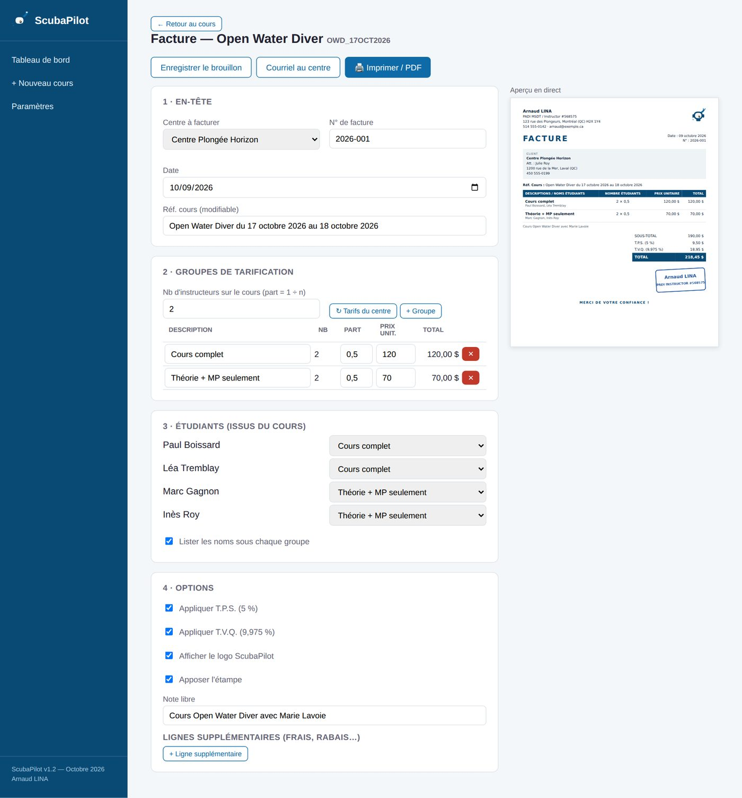
*L'éditeur de facture avec aperçu en direct*


1. **En-tête** — Centre à facturer (celui du cours par défaut ; changer de centre recharge ses tarifs tant que vous n'avez pas modifié les groupes), numéro (suggéré automatiquement : `ANNÉE-001`, `ANNÉE-002`…), date, « Réf. Cours » (préremplie avec le type et les dates, modifiable).
2. **Groupes de tarification** — Pour chaque groupe : description, **part**, prix unitaire. Le total d'un groupe = nombre d'étudiants × part × prix. La part est proposée à **1 ÷ nombre d'instructeurs** (2 instructeurs → 0,5) ; modifiez le champ « Nb d'instructeurs » (toutes les parts sont recalculées) ou chaque part individuellement. Boutons **+ Groupe**, **↻ Tarifs du centre** (recharge la grille) et ✕ pour retirer un groupe.
3. **Étudiants** — La liste vient du cours. Affectez chacun à un groupe (au départ, tous sont dans le premier) ; cochez « Lister les noms sous chaque groupe » selon votre préférence.
4. **Options** — T.P.S./T.V.Q., logo ScubaPilot, étampe, **note libre** (préremplie « Cours … avec [collègue] » quand le cours a plusieurs instructeurs), et **lignes supplémentaires** (frais, ou montant négatif pour un rabais).

Exemple : 6 étudiants « Cours complet » (0,5 × 120 $ = 360 $) et 4 étudiants « Théorie + MP seulement » (0,5 × 70 $ = 140 $) donnent un sous-total de 500 $.

### 9.3 Enregistrer, imprimer, envoyer

- **Enregistrer le brouillon** : conserve la facture avec le cours ; vous pouvez la rouvrir et la modifier.
- **Imprimer / PDF** : enregistre puis ouvre la facture (format Letter) dans un nouvel onglet. Cliquez sur « Imprimer / Enregistrer en PDF » et choisissez **Enregistrer en PDF** comme imprimante. Si rien ne s'ouvre, autorisez les popups pour `localhost`.
- **Courriel au centre** : ouvre un courriel adressé au centre, objet et message prêts. **Joignez-y le PDF** produit à l'étape précédente.

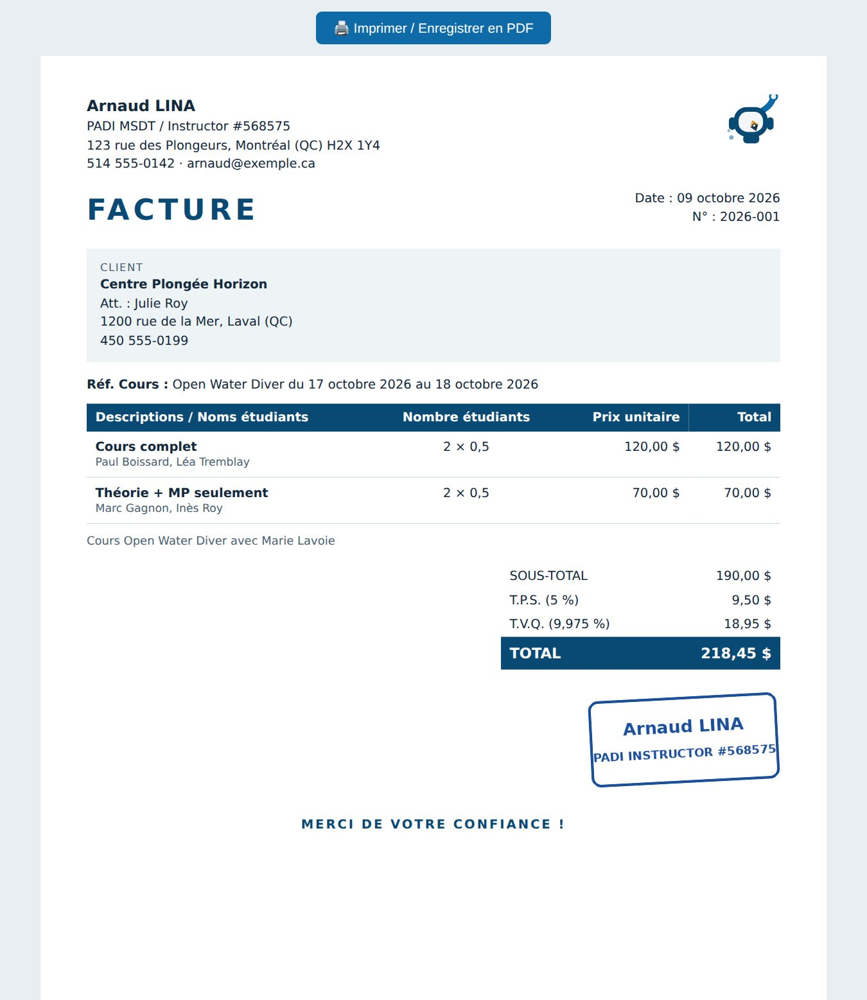
*La facture imprimée (format Letter)*


Le numéro suggéré n'avance que lorsque vous enregistrez une facture avec ce numéro ; si vous le modifiez à la main, le compteur n'est pas touché.

## 10. Rapports et sommaire

- **Rapport de cours** (fiche du cours → **🖨️ Exporter un rapport**) : séances, documents généraux et, pour chaque étudiant, coordonnées, âge, checklist détaillée, certification ou transfert, instructeur certificateur. Impression ou PDF depuis l'onglet qui s'ouvre.
- **Sommaire des activités accomplies** (tableau de bord) : tous vos cours (date, type, nombre d'étudiants, centre), du plus récent au plus ancien, avec totaux de cours et d'étudiants.

## 11. Paramètres en détail

| Carte | Contenu |
|---|---|
| Répertoire racine | Dossier où sont rangés cours et documents |
| Vos coordonnées | Nom, PADI, adresse, téléphone, courriel, CC et BCC par défaut |
| Centres partenaires | Centres qui vous mandatent (obligatoires pour créer un cours) |
| Facturation | Devise, taxes, pied de page, étampe, grilles de tarifs |
| Coéquipiers | Collègues et instructeurs (courriel, rôle) |
| Modèles d'email | Bibliothèque de modèles avec variables |
| Types de cours | Modèles de cours et leurs 4 listes de documents |
| Sites de plongée | Lieux utilisés dans les séances |
| Champs du profil étudiant | Champs du formulaire étudiant |
| Sauvegarde | Archive .zip du répertoire racine |
| À propos | Version et logo |

### Types de cours

Chaque type contient quatre listes de documents :

- `preDocs` / `postDocs` : documents à collecter **par étudiant**, avant et après le cours ;
- `generalPreDocs` / `generalPostDocs` : documents **généraux** du cours, cochés une fois pour tout le cours.

Chaque document a un libellé et une exigence (obligatoire, facultatif, conditionnel). Ne **changez pas l'identifiant** d'un document existant : il relie la case aux étudiants déjà cochés.

### Champs du profil étudiant

Ajoutez, modifiez ou supprimez des champs ; choisissez le type (*Texte, Téléphone, Email, Date, Texte long, Liste déroulante*), le caractère obligatoire et, pour une liste, ses options. Gardez toujours **Prénom** et **Nom** : ils nomment les dossiers sur le disque. Le champ « Statut » pilote la certification ou le transfert de dossier.

### Logo

Le logo est le fichier `public/logo.svg`. Pour le remplacer, écrasez ce fichier en gardant le même nom.

## 12. Organisation des données sur le disque

```
<répertoire racine>/
  OWD_03OCT2026/
    course.json
    Photo/
    Paul BOISSARD/
      student.json
      (scans, photos, PDF…)
    Léa TREMBLAY/
      student.json
  RESCUE_05OCT2026/
    course.json
    …
```

- Un cours = un dossier `TYPE_DATE`. Un étudiant = un sous-dossier `Prénom NOM`.
- `course.json` et `student.json` sont gérés par l'application (la facture est enregistrée dans `course.json`). Ne les renommez pas.
- Les réglages (types de cours, centres, tarifs, modèles, etc.) sont dans le dossier **`data/`** de l'application, **pas** dans le répertoire racine :

| Fichier | Contenu |
|---|---|
| `settings.json` | Répertoire racine, vos coordonnées |
| `centers.json` | Centres partenaires |
| `buddies.json` | Coéquipiers |
| `course_types.json` | Types de cours et documents |
| `sites.json` | Sites de plongée |
| `student_fields.json` | Champs du profil étudiant |
| `email_templates.json` | Modèles d'email |
| `billing.json` | Devise, taxes, grilles de tarifs, compteur de factures |
| `stamp.json` | Image de l'étampe (non versionnée dans Git) |

## 13. Sauvegarde

Deux choses à sauvegarder : le **répertoire racine** (vos cours) et le dossier **`data/`** (vos réglages).

- **Répertoire racine** : Paramètres → carte **Sauvegarde** → bouton de création. L'application crée un .zip de tout le répertoire (cours, documents, photos) et vous laisse choisir où l'enregistrer (clé USB, disque externe, OneDrive, etc.). Le nom inclut la date : `PLONGEE_BACKUP_AAAAMMJJ_HHMM.zip`. Pour un gros répertoire, comptez quelques dizaines de secondes à quelques minutes ; le bouton reste désactivé pendant ce temps.
- **Dossier `data/`** : copiez-le manuellement de temps en temps (ou après chaque changement important de configuration).

Conseil : sauvegardez avant toute suppression de cours et avant chaque mise à jour.

## 14. Mise à jour de l'application

1. Fermez l'application (`Arreter.bat`).
2. **Remplacez** : `server.js`, `package.json`, le dossier `public/`, `README.md`, `docs/` et les scripts `.bat`/`.vbs`.
3. **Ne remplacez jamais** vos fichiers du dossier `data/` : ils contiennent votre travail (types de cours, centres, tarifs, modèles, etc.). L'application crée seule les nouveaux fichiers dont elle a besoin au démarrage.
4. Si `package.json` a changé, relancez `npm install` dans le dossier.
5. Relancez l'application et rechargez la page (`Ctrl + F5`). Vérifiez le numéro de version en bas de la barre latérale.

Avec Git : `git pull`, puis `npm install` si nécessaire. Vos fichiers `data/` modifiés peuvent entrer en conflit avec ceux du dépôt : gardez les vôtres.

### Historique des versions

| Version | Principales nouveautés |
|---|---|
| 1.3 | Petit calendrier 📅 à côté de chaque date, saisie d'heure 24 h au clavier avec suggestions toutes les 15 minutes |
| 1.2 | Éditeur de facture (groupes de tarifs, parts, taxes, logo, étampe, aperçu, PDF, courriel), grilles de tarifs par centre et type, numérotation automatique, adresse de l'instructeur |
| 1.1 | Transfert de dossier pour les étudiants « cours seulement », instructeur certificateur choisi parmi les coéquipiers, correction du calcul des %, fichiers sans cache, version affichée |
| 1.0 | Cours, étudiants, checklists, emails, rapports, sauvegarde, logo |

## 15. Dépannage

**La page ne s'ouvre pas à `localhost:4531`.** L'application n'est pas démarrée : lancez `Lancer (avec fenetre).bat` ou vérifiez que la fenêtre noire est toujours ouverte. Avec le démarrage automatique, consultez `app.log`.

**« node n'est pas reconnu… »** Node.js n'est pas installé ou la session doit être rouverte : réinstallez Node.js puis rouvrez l'invite de commande.

**« Cannot find module 'express' ».** Les dépendances ne sont pas installées : exécutez `npm install` dans le dossier de l'application.

**Le port 4531 est déjà utilisé.** L'application tourne peut-être déjà : double-cliquez sur `Arreter.bat`, puis relancez-la.

**Après une mise à jour, je ne vois pas les nouveautés.** Rechargez sans cache (`Ctrl + F5`). Vérifiez que `public/` a bien été remplacé en entier et que le numéro de version en bas de la barre latérale est le bon.

**« Répertoire racine non défini ».** Allez dans Paramètres, indiquez le répertoire racine et enregistrez.

**Je ne peux pas créer de cours.** Il faut au moins un centre partenaire (Paramètres → Centres).

**La facture ou le rapport ne s'ouvre pas.** Le navigateur bloque la fenêtre : autorisez les popups pour `localhost`.

**Le logo ou l'étampe n'apparaît pas sur la facture.** Vérifiez que la case correspondante est cochée sur la facture et que l'image d'étampe est bien enregistrée (Paramètres → Facturation). Le PDF doit être généré depuis l'onglet de la facture.

**Mon pourcentage de documents semble faux.** Rouvrez la fiche de l'étudiant : le calcul se fait à partir des documents du type de cours.

**La case « Certification confirmée » est grisée.** Choisissez d'abord un instructeur certificateur.

**Je ne vois pas « Transfert de dossier ».** Il n'apparaît que pour un étudiant en « cours seulement » ; vérifiez son statut et rechargez la page (`Ctrl + F5`).

**Un étudiant est « en double » entre deux cours.** C'est normal : chaque cours garde son dossier étudiant ; la fiche globale les réunit.

## 16. Notes techniques

- Serveur Node.js (Express) uniquement local, sur `localhost:4531` ; rien n'est envoyé sur internet.
- Interface en JavaScript pur (sans framework), données en fichiers JSON : aucune base de données à installer.
- Le bouton « Ouvrir dans l'Explorateur » utilise la commande Windows `explorer` ; la sauvegarde utilise `Compress-Archive` (PowerShell). Sous macOS ou Linux, ces deux fonctions sont à adapter.
- Les fichiers statiques sont servis sans cache, et les scripts sont référencés avec un numéro de version pour éviter les anciennes copies.
- Code source : <https://github.com/almtlsandbox/scubapilot> (dépôt privé).
